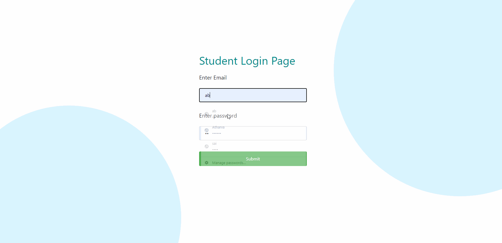
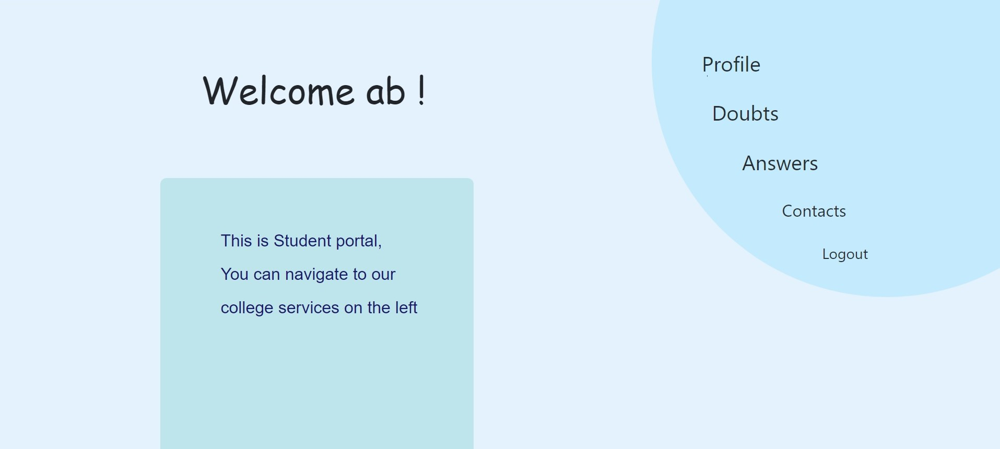
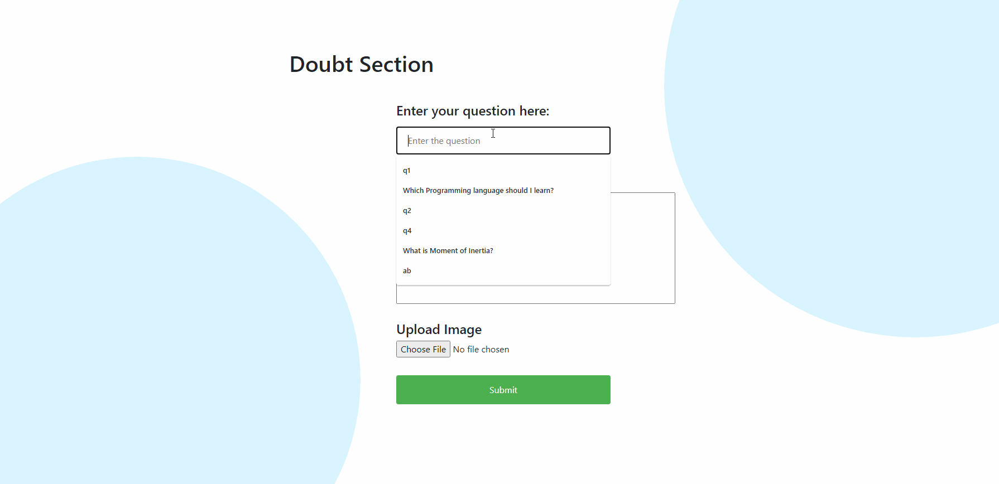
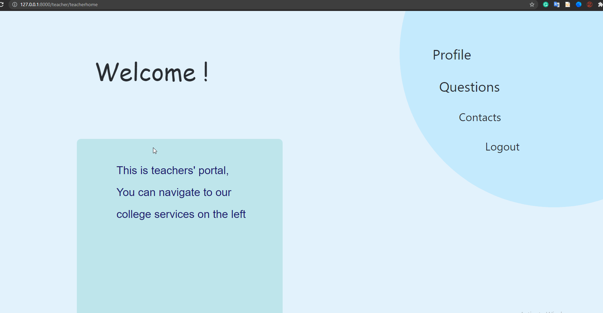
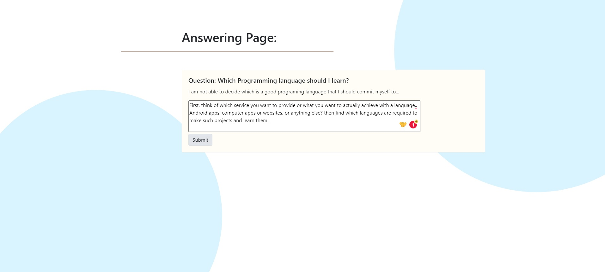
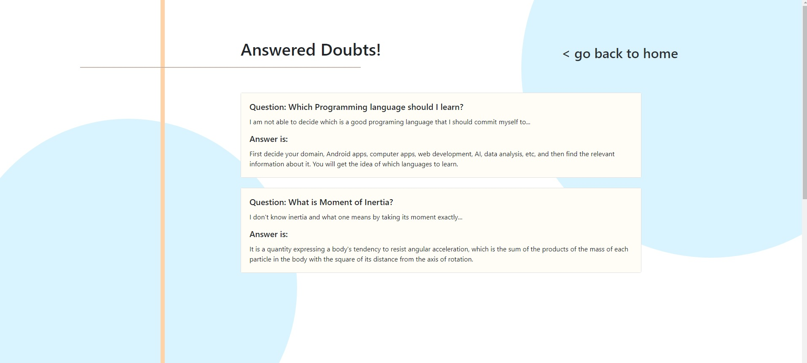
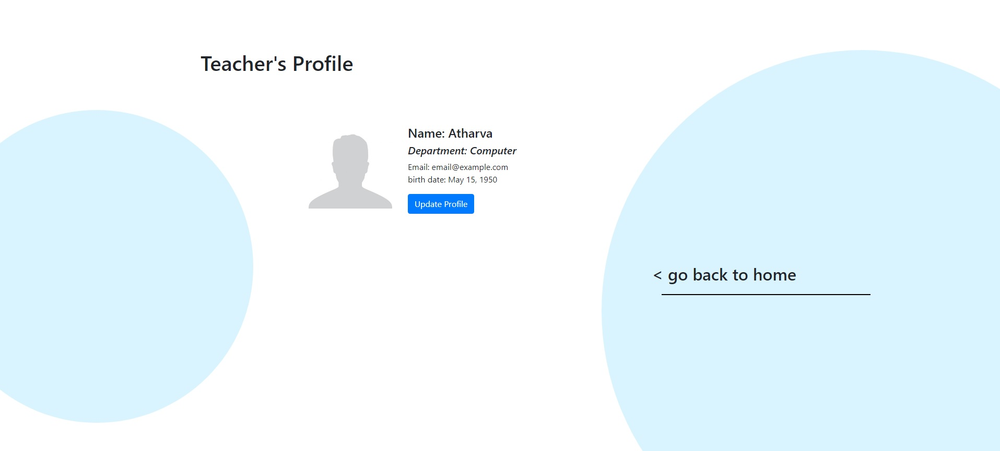
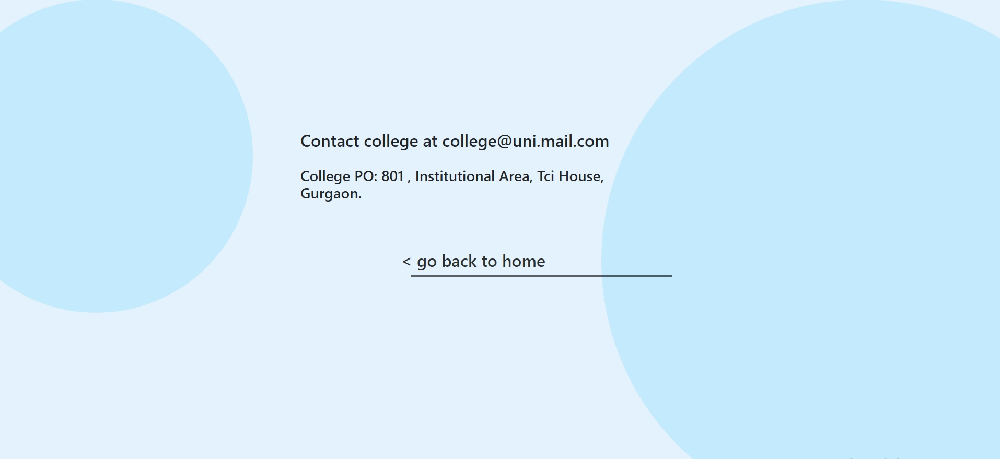
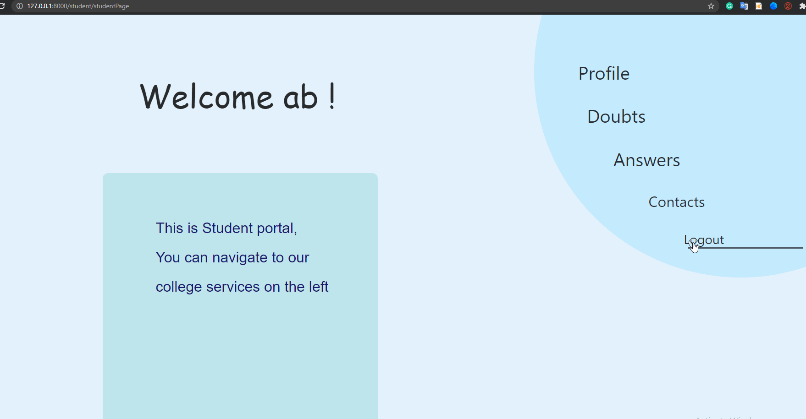

# StudentPortal
An interaction platform for teachers and students built upon Django framework for web. Here, after logging in students can ask doubts and teachers can answer them. The database is managed in the Django framework itself.

# Scope
- colleges can manage database and add features of their own when needed.
- a seperate portal will help students and teacher access webapps' features conviniently for their benifit.
- online exam systems desigined specifically by colleges can be implemented in future.

## Features
- Doubt section - Students can ask doubts
- Answering section - teachers can get the list of students doubts and answer them.
- contacts - for college contact details
- basic Login and logout system

## Implementation
- Used Django framework for backend and database management
- html, css and javascript for frontend

# Pages

## Log in 
-login feature for students and teachers (image: Student login page similarly for teachers)

## Home page
- for clear navigation (student side)

## Doubt Asking
- Doubt posting section for students

## Doubt browsing and answering (teacher's side)
- Listing all doubts concisely for teacher to choose and answer..

## Doubt Answering
- Doubt answering page for teacher

## Answered Doubt section
- Answered Doubt Section for students

## Profile pages
- profile page for student/teacher personal information management. (image: teacher's profile)

## Contacts page
- contacts page for students and teachers for further/other communication

## and Finally logout
- multi user system..

